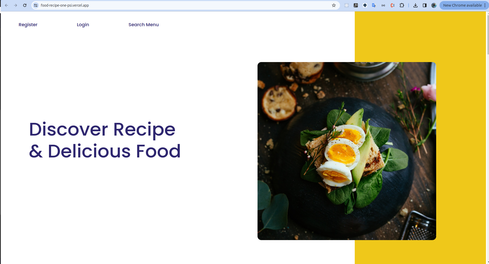

# React + Vite

This template provides a minimal setup to get React working in Vite with HMR and some ESLint rules.

Currently, two official plugins are available:

-   [@vitejs/plugin-react](https://github.com/vitejs/vite-plugin-react/blob/main/packages/plugin-react/README.md) uses [Babel](https://babeljs.io/) for Fast Refresh
-   [@vitejs/plugin-react-swc](https://github.com/vitejs/vite-plugin-react-swc) uses [SWC](https://swc.rs/) for Fast Refresh

# About Bookflight Projects

book flight app
flight book application is a web-based airplane ticket booking application, this application makes it easy for everyone to book airplane tickets anytime and anywhere.

# Built With

[](https://github.com/rikiprimus/FE-hirejob/blob/main/README.md#built-with)

This app was built with some technologies below:

-   [Vite React](https://vitejs.dev/guide/)
-   [CSS](https:developer.mozilla.org/en-US/docs/Web/CSS)
-   [React](https://reactjs.org/)
-   [Axios](https://axios-http.com/)
-   [Redux](https://https://redux.js.org/)

# Node Engine Version

v20.9.0

# UI Design

[UI Design](<https://www.figma.com/file/Jh49liDkzdlKMSgFiLeePy/Food-Recipe-(Brakdown)?type=design&node-id=47-1273&mode=design&t=360iXTVfV2c8FPlQ-0>)

# User Account

email : test7@gmail.com
password : test7

# Deploy on Vercel

The easiest way to deploy your Next.js app is to use the [Vercel Platform](https://vercel.com/new?utm_medium=default-template&filter=next.js&utm_source=create-next-app&utm_campaign=create-next-app-readme) from the creators of Next.js.

Check out our [Next.js deployment documentation](https://nextjs.org/docs/deployment) for more details.

Open [food-recipe-one-psi-.vercel.app](https://food-recipe-one-psi.vercel.app/) with your browser to see the result.



# Getting Started

First, run the development server:

```shell
npm run dev
# or
yarn dev
# or
pnpm dev
# or
bun dev
```

Open [http://localhost:3000](http://localhost:3000/) with your browser to see the result.

You can start editing the page by modifying `src/page.jsx`. The page auto-updates as you edit the file.
